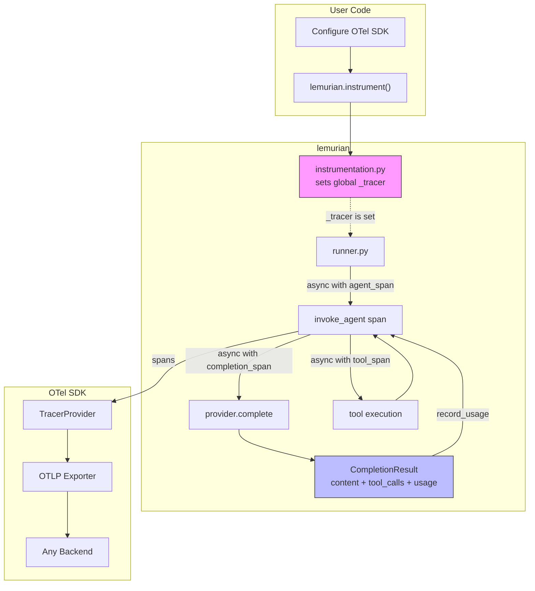
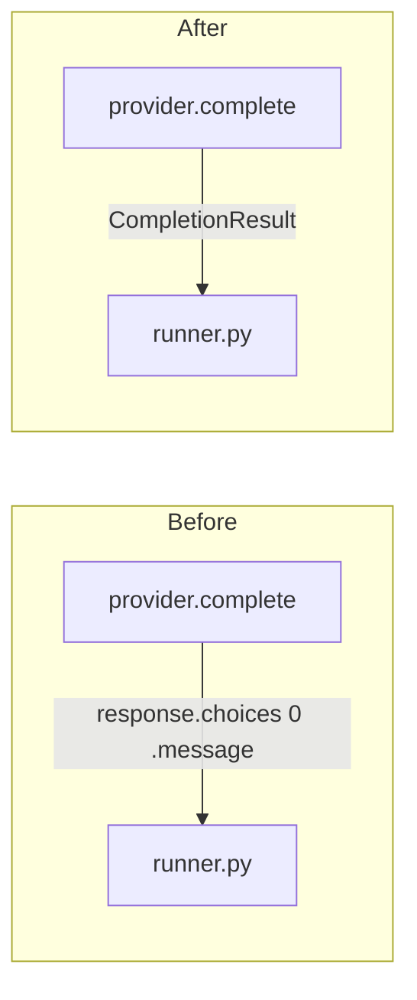
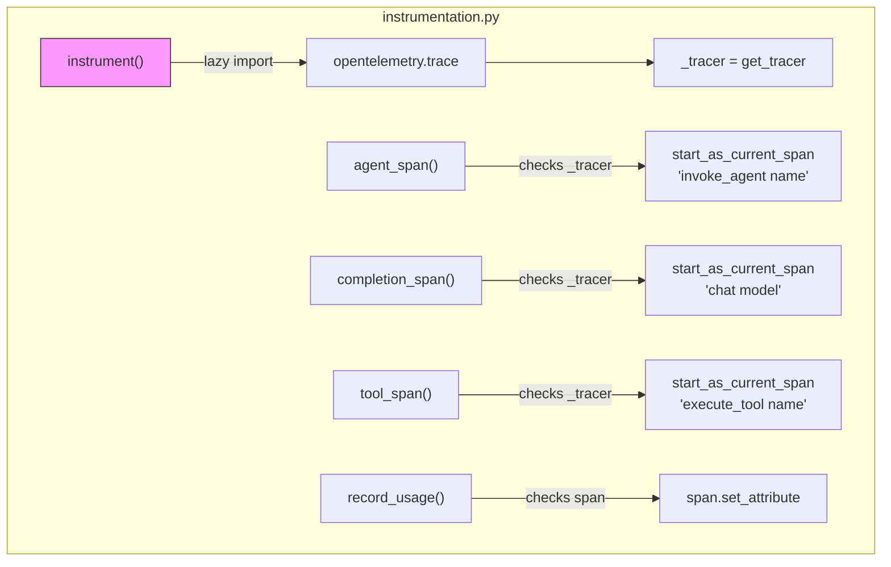
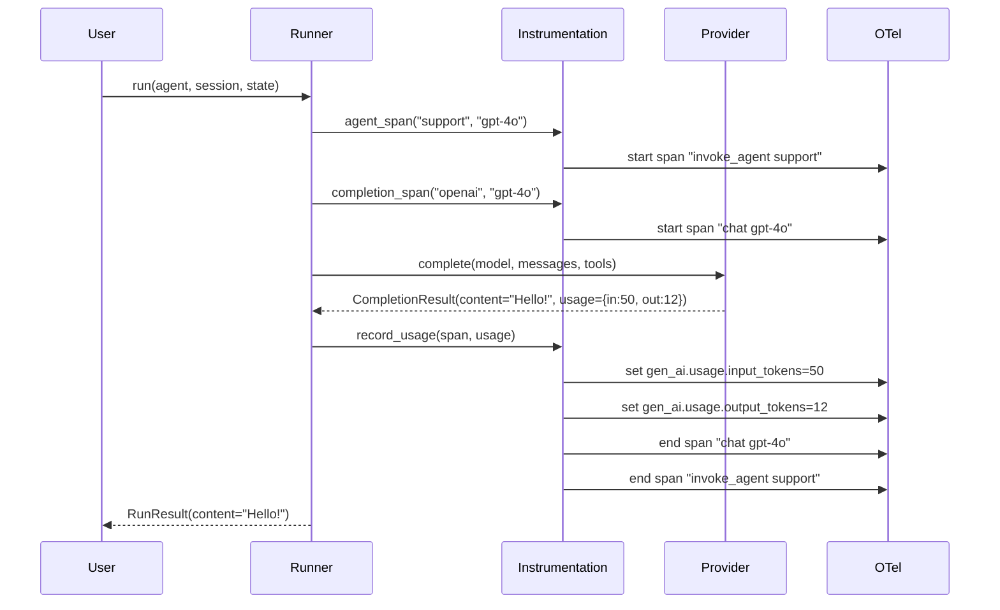
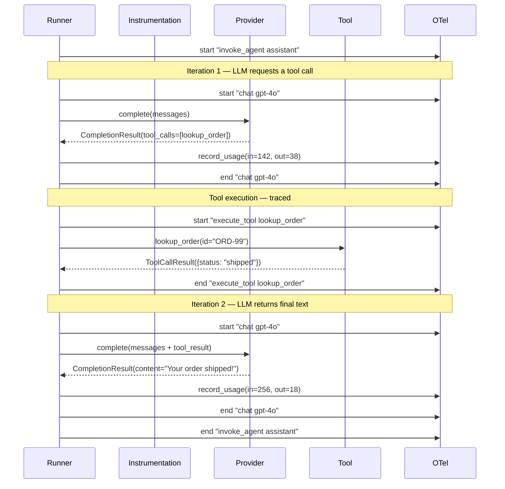
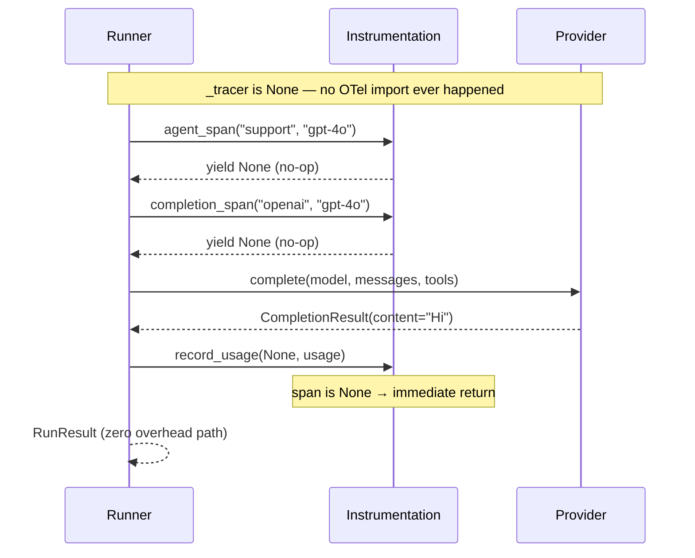

# OpenTelemetry Integration Design

## Goals

- Emit OpenTelemetry traces from `Runner.run()` and `provider.complete()` following the [GenAI Semantic Conventions](https://opentelemetry.io/docs/specs/semconv/gen-ai/).
- One-call activation: `lemurian.instrument()` enables tracing globally.
- Zero overhead when disabled: no OTel imports, no span creation, no dependency required.
- Compatible with any OTLP-capable backend (Datadog, Honeycomb, Jaeger, Grafana Tempo).
- Expose token usage (`input_tokens`, `output_tokens`) from provider responses.

## Non-Goals

- Recording message content on spans (privacy-sensitive; future opt-in flag).
- Emitting OTel metrics / histograms (see [Future Work: Metrics](#future-work-metrics)).
- Auto-detecting or auto-configuring a `TracerProvider` (user configures their SDK).
- Instrumenting `structured_completion()` (only `complete()` is used by the Runner).

## Overall Design



### TracerProvider Behavior

`lemurian.instrument()` calls `trace.get_tracer("lemurian")`. What the tracer does depends entirely on whether the **user** has configured a `TracerProvider`:

| User setup | What `get_tracer()` returns | Where spans go |
|---|---|---|
| No `TracerProvider` configured | `NoOpTracer` | Nowhere (silently discarded) |
| `TracerProvider` + `ConsoleSpanExporter` | Real `Tracer` | Printed to stdout |
| `TracerProvider` + `OTLPSpanExporter` | Real `Tracer` | Backend via OTLP |

This is standard OTel library behavior — libraries always create spans; applications decide where they go. If `instrument()` detects a `NoOpTracer`, it logs a hint:

```python
import importlib.util

def instrument(*, tracer_name: str = "lemurian") -> None:
    global _tracer
    if importlib.util.find_spec("opentelemetry.trace") is None:
        raise ImportError(
            "opentelemetry-api is required for instrumentation. "
            "Install it with: pip install lemurian[otel]"
        )
    from opentelemetry import trace
    _tracer = trace.get_tracer(tracer_name)
    if isinstance(_tracer, trace.NoOpTracer):
        logger.info(
            "No TracerProvider configured — spans will be "
            "discarded. Set up a TracerProvider to export traces."
        )

def uninstrument() -> None:
    """Disable OpenTelemetry tracing."""
    global _tracer
    _tracer = None
```

## Sub-Component Designs

### 1. `CompletionResult` — Provider Return Type

Providers currently return raw `response.choices[0].message`, discarding usage data. A thin wrapper preserves it.



```python
# provider.py

@dataclass
class CompletionResult:
    content: str | None = None
    tool_calls: list | None = None
    usage: object | None = None       # e.g. OpenAI Usage object
    response_model: str | None = None  # actual model returned
```

Each provider wraps its return:

```python
# In every provider's complete():
response = await self.client.chat.completions.create(**kwargs)
msg = response.choices[0].message
return CompletionResult(
    content=msg.content,
    tool_calls=msg.tool_calls,
    usage=getattr(response, "usage", None),
    response_model=getattr(response, "model", None),
)
```

Provider identity for `gen_ai.provider.name`:

```python
class ModelProvider:
    system_name: str = "unknown"

class OpenAIProvider(ModelProvider):
    system_name: str = "openai"

class OpenRouter(ModelProvider):
    system_name: str = "openrouter"

class VLLMProvider(ModelProvider):
    system_name: str = "vllm"

class ModalVLLMProvider(ModelProvider):
    system_name: str = "vllm"
```

### 2. `instrumentation.py` — Tracing Module



```python
# instrumentation.py

_tracer: Tracer | None = None

def instrument(*, tracer_name: str = "lemurian") -> None:
    """Enable OpenTelemetry tracing for all lemurian operations.

    Call once at startup, after configuring your TracerProvider.
    Requires ``opentelemetry-api``: ``pip install lemurian[otel]``

    Example — explicit SDK setup::

        from opentelemetry.sdk.trace import TracerProvider
        from opentelemetry.sdk.trace.export import (
            BatchSpanProcessor,
        )
        from opentelemetry.exporter.otlp.proto.grpc.trace_exporter import (
            OTLPSpanExporter,
        )
        from opentelemetry import trace

        provider = TracerProvider()
        provider.add_span_processor(
            BatchSpanProcessor(OTLPSpanExporter())
        )
        trace.set_tracer_provider(provider)

        import lemurian
        lemurian.instrument()

    Example — zero-code via ``opentelemetry-instrument``::

        $ pip install opentelemetry-distro opentelemetry-exporter-otlp
        $ opentelemetry-bootstrap -a install
        $ OTEL_SERVICE_NAME=my-agent \\
          OTEL_EXPORTER_OTLP_ENDPOINT=http://localhost:4317 \\
          opentelemetry-instrument python my_app.py

        # In my_app.py, just call:
        import lemurian
        lemurian.instrument()

    See also:
        - OTel Python SDK: https://opentelemetry.io/docs/languages/python/
        - GenAI Semantic Conventions: https://opentelemetry.io/docs/specs/semconv/gen-ai/
        - Zero-code instrumentation: https://opentelemetry.io/docs/zero-code/python/

    Args:
        tracer_name: Name passed to ``trace.get_tracer()``.

    Raises:
        ImportError: If ``opentelemetry-api`` is not installed.
    """
    global _tracer
    from opentelemetry import trace  # lazy — only here
    _tracer = trace.get_tracer(tracer_name)

@asynccontextmanager
async def agent_span(agent_name: str, model: str):
    if _tracer is None:
        yield None
        return
    with _tracer.start_as_current_span(
        f"invoke_agent {agent_name}",
        attributes={
            "gen_ai.operation.name": "invoke_agent",
            "gen_ai.agent.name": agent_name,
            "gen_ai.request.model": model,
        },
    ) as span:
        yield span

@asynccontextmanager
async def completion_span(system: str, model: str):
    if _tracer is None:
        yield None
        return
    from opentelemetry.trace import SpanKind
    with _tracer.start_as_current_span(
        f"chat {model}",
        kind=SpanKind.CLIENT,
        attributes={
            "gen_ai.operation.name": "chat",
            "gen_ai.provider.name": system,
            "gen_ai.request.model": model,
        },
    ) as span:
        yield span

@asynccontextmanager
async def tool_span(tool_name: str, call_id: str):
    if _tracer is None:
        yield None
        return
    with _tracer.start_as_current_span(
        f"execute_tool {tool_name}",
        attributes={
            "gen_ai.operation.name": "execute_tool",
            "gen_ai.tool.name": tool_name,
            "gen_ai.tool.call.id": call_id,
        },
    ) as span:
        yield span

def record_usage(span, usage, response_model: str | None = None):
    if span is None or usage is None:
        return
    if hasattr(usage, "prompt_tokens") and usage.prompt_tokens is not None:
        span.set_attribute("gen_ai.usage.input_tokens", usage.prompt_tokens)
    if hasattr(usage, "completion_tokens") and usage.completion_tokens is not None:
        span.set_attribute("gen_ai.usage.output_tokens", usage.completion_tokens)
    if response_model:
        span.set_attribute("gen_ai.response.model", response_model)

def record_error(span, exception: BaseException) -> None:
    """Record an exception and set ERROR status on a span."""
    if span is None:
        return
    from opentelemetry.trace import StatusCode
    span.set_status(StatusCode.ERROR, str(exception))
    span.record_exception(exception)
    span.set_attribute("error.type", type(exception).__qualname__)
```

### 3. Runner Integration

Three `async with` blocks plus `record_error` calls added to `Runner.run()`:

```python
# runner.py — modified run()

from lemurian.instrumentation import (
    agent_span, completion_span, record_error, record_usage, tool_span,
)

async def run(self, agent, session, state, context_start=0) -> RunResult:
    ctx = Context(session=session, state=state, agent=agent)
    tool_registry = agent.tool_registry
    tool_schemas = [t.model_dump() for t in tool_registry.values()]

    async with agent_span(agent.name, agent.model):
        for _ in range(self.max_turns):
            # ... build messages ...

            system_name = getattr(agent.provider, "system_name", "unknown")
            async with completion_span(system_name, agent.model) as c_span:
                response = await agent.provider.complete(
                    model=agent.model,
                    messages=messages,
                    tools=tool_schemas if tool_schemas else None,
                )
                record_usage(c_span, response.usage, response.response_model)

            # ... for each tool_call:
            async with tool_span(func_name, call_id) as t_span:
                try:
                    result = await tool_obj(**params)
                except LLMRecoverableError as e:
                    record_error(t_span, e)  # mark span as failed
                    ...
                except Exception as e:
                    record_error(t_span, e)  # mark span as failed
                    ...

        # max turns timeout
        ...
```

The three spans auto-nest via OTel context propagation:
- `agent_span` is the root (or child of an existing trace)
- `completion_span` and `tool_span` are children of `agent_span`
- No explicit parent wiring needed

## Example Data Flow Diagrams

### Flow 1: Single LLM Call (No Tools)



### Flow 2: Tool-Calling Loop (Two LLM Calls)



### Flow 3: Instrumentation Disabled (Default)



### Resulting Span Hierarchy

```mermaid
gantt
    title Span Timeline for a 2-iteration tool-calling run
    dateFormat X
    axisFormat %s

    section Agent
    invoke_agent assistant : 0, 900

    section LLM Calls
    chat gpt-4o (tool request)   : 50, 300
    chat gpt-4o (final response) : 550, 850

    section Tools
    execute_tool lookup_order : 300, 550
```



## Span Attribute Reference

| Span | Attribute | Source |
|------|-----------|--------|
| `invoke_agent {name}` | `gen_ai.operation.name` | `"invoke_agent"` |
| | `gen_ai.agent.name` | `agent.name` |
| | `gen_ai.request.model` | `agent.model` |
| `chat {model}` (kind=CLIENT) | `gen_ai.operation.name` | `"chat"` |
| | `gen_ai.provider.name` | `provider.system_name` |
| | `gen_ai.request.model` | `agent.model` |
| | `gen_ai.response.model` | `CompletionResult.response_model` |
| | `gen_ai.usage.input_tokens` | `usage.prompt_tokens` |
| | `gen_ai.usage.output_tokens` | `usage.completion_tokens` |
| `execute_tool {name}` | `gen_ai.operation.name` | `"execute_tool"` |
| | `gen_ai.tool.name` | `tool_call.function.name` |
| | `gen_ai.tool.call.id` | `tool_call.id` |
| | `error.type` | `type(exception).__qualname__` (on failure) |

## Future Work: Metrics

OTel **metrics** are a separate signal from traces. Where traces capture individual operations (one span per LLM call), metrics are pre-aggregated numerical measurements (counters, histograms) designed for dashboards and alerting.

The GenAI semantic conventions define two key metrics:

| Metric | Type | What it measures |
|--------|------|-----------------|
| `gen_ai.client.token.usage` | Histogram | Token counts per call, bucketed by `gen_ai.token.type` (`"input"` / `"output"`) |
| `gen_ai.client.operation.duration` | Histogram | LLM call latency in seconds |

**Why not now:**

1. **Metrics require a separate SDK pipeline.** The user must configure a `MeterProvider` + metric exporter independently from their `TracerProvider`. This doubles configuration surface for minimal gain.
2. **Span attributes already carry the data.** Any backend (Datadog, Honeycomb, Grafana) can derive histograms from the `gen_ai.usage.input_tokens` span attributes we already emit. No additional code needed on our side.
3. **Additive.** Adding metrics later is fully backward-compatible — it's new code alongside existing spans, no interface changes.

When the time comes, the implementation is ~20 lines: create a `Meter`, define two histograms, and `.record()` after each `provider.complete()` call. The user would need `opentelemetry-sdk` with metrics support and a metrics exporter configured.

## Files Changed

| File | Change |
|------|--------|
| `src/lemurian/provider.py` | Add `CompletionResult`, `system_name`, change `complete()` returns |
| `src/lemurian/instrumentation.py` | **New.** `instrument()`, `uninstrument()`, span helpers (`agent_span`, `completion_span` w/ `SpanKind.CLIENT`, `tool_span`), `record_usage()`, `record_error()` |
| `src/lemurian/runner.py` | Add imports, wrap body in `agent_span` + `completion_span` + `tool_span`, call `record_error` in tool except blocks |
| `src/lemurian/__init__.py` | Export `instrument`, `uninstrument` |
| `pyproject.toml` | Add `[project.optional-dependencies] otel`, add `opentelemetry-api` to dev deps |
| `tests/conftest.py` | Replace `MockResponse` with `CompletionResult` |
| `tests/unit/test_instrumentation.py` | **New.** Unit tests for instrumentation module |
