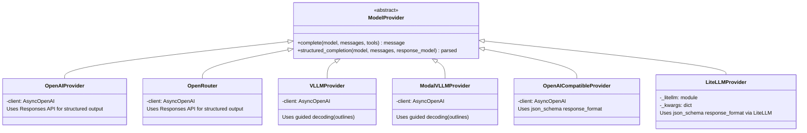
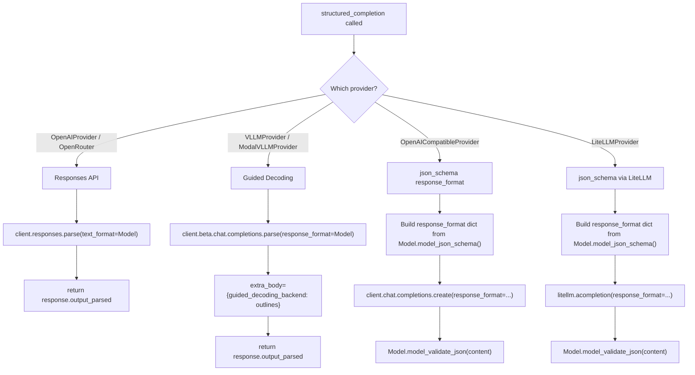
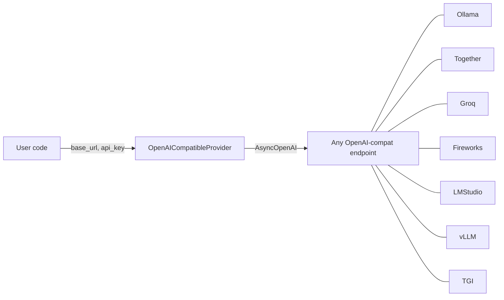
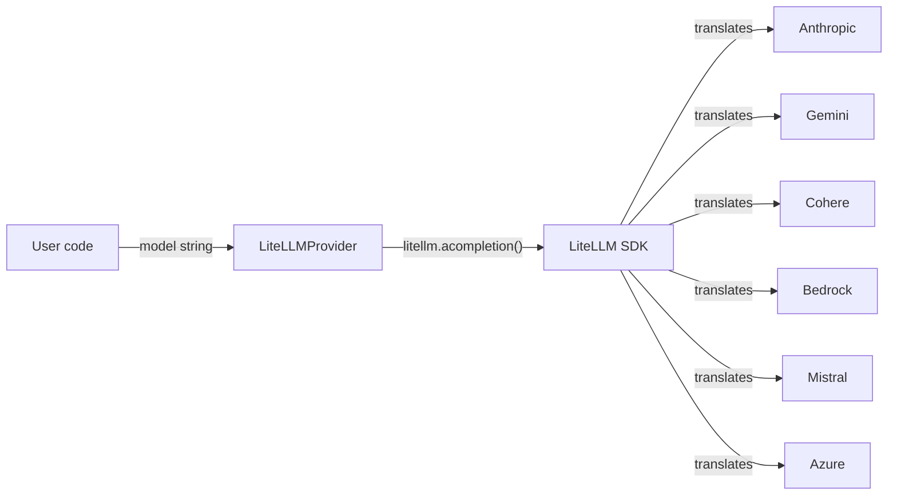
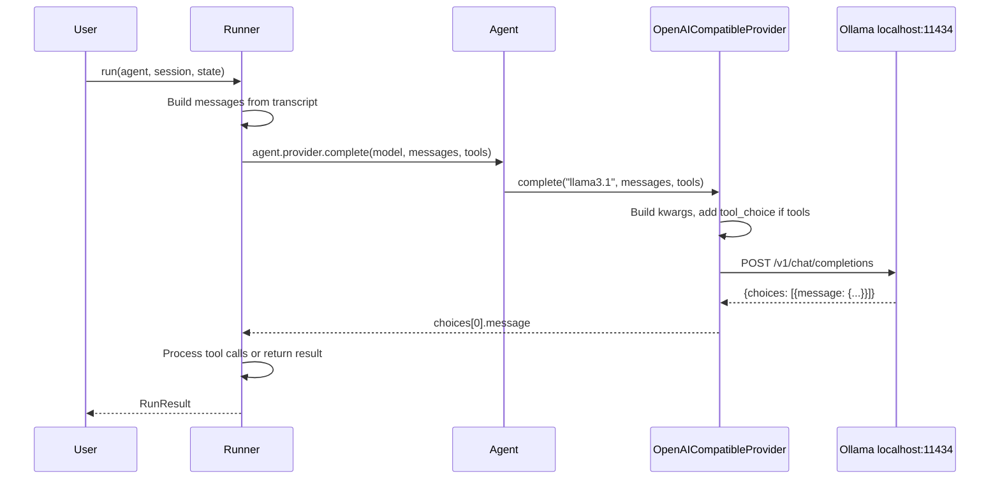
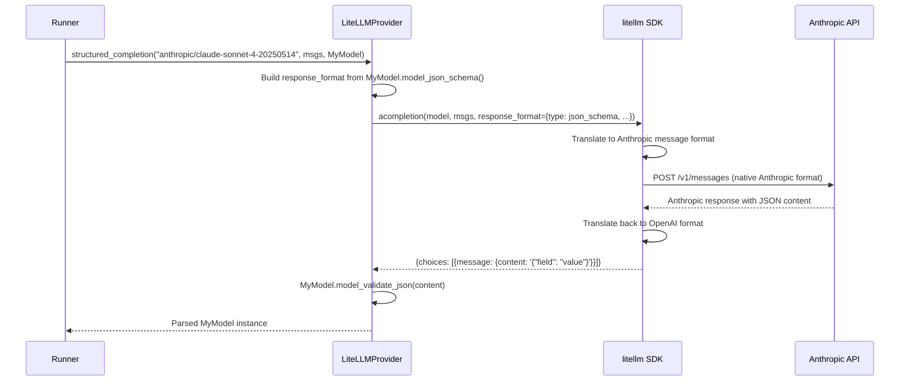
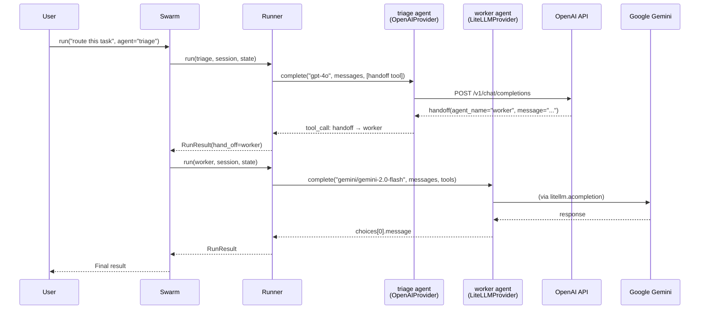
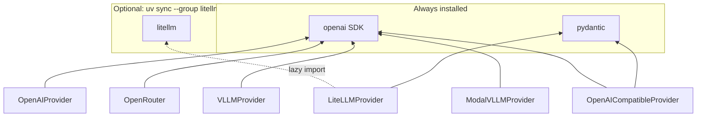

# Provider Expansion

Add two new `ModelProvider` subclasses — `OpenAICompatibleProvider` and `LiteLLMProvider` — to cover the long tail of LLM endpoints without modifying existing providers.

## Goals

- Let users connect **any OpenAI-compatible endpoint** (Ollama, Together, Groq, Fireworks, LM Studio, vLLM, TGI) with a single `base_url`.
- Let users connect **non-OpenAI providers** (Anthropic, Gemini, Cohere, Bedrock, 100+ others) via LiteLLM as an optional dependency.
- Both `complete()` and `structured_completion()` work out of the box on both new providers.
- Zero new required dependencies. LiteLLM is optional and lazy-imported.

## Non-Goals

- **Streaming.** The `ModelProvider` ABC and `Runner` have no streaming path today. Streaming is additive (new methods) and orthogonal to this work.
- **Replacing existing providers.** `OpenAIProvider`, `OpenRouter`, `VLLMProvider`, and `ModalVLLMProvider` have provider-specific optimizations (Responses API, guided decoding) that a generic provider cannot replicate. They stay as-is.
- **Direct Anthropic/Gemini SDKs.** First-class wrappers around individual non-OpenAI SDKs are high-maintenance for a project this size. LiteLLM covers these providers without per-SDK code.
- **LiteLLM proxy server mode.** Only the Python SDK (`litellm.acompletion`) is used. The proxy/gateway deployment is out of scope.

## Overall Design



## Structured Output Strategy

Each provider uses the structured output mechanism best suited to its backend. The key design question is how `structured_completion()` enforces JSON conforming to a Pydantic schema.



The new providers both use the `json_schema` `response_format` approach — the most universally supported method across OpenAI-compatible servers and LiteLLM's 100+ provider translations.

## Component: `OpenAICompatibleProvider`

Wraps `AsyncOpenAI` pointed at an arbitrary `base_url`. No URL auto-manipulation, no provider-specific assumptions.



```python
class OpenAICompatibleProvider(ModelProvider):

    def __init__(
        self,
        base_url: str,
        api_key: str | None = None,
        timeout: float = 300.0,
        max_retries: int = 3,
    ):
        self.base_url = base_url.rstrip("/")
        self.client = AsyncOpenAI(
            base_url=self.base_url,
            api_key=api_key or "DUMMY",
            timeout=timeout,
            max_retries=max_retries,
        )

    async def complete(self, model, messages, tools=None):
        kwargs = {"model": model, "messages": messages}
        if tools:
            kwargs["tools"] = tools
            kwargs["tool_choice"] = "auto"
        resp = await self.client.chat.completions.create(
            **kwargs
        )
        return resp.choices[0].message

    async def structured_completion(
        self, model, messages, response_model,
    ):
        response_format = {
            "type": "json_schema",
            "json_schema": {
                "schema": response_model.model_json_schema(),
                "name": response_model.__name__,
                "strict": True,
            },
        }
        resp = await self.client.chat.completions.create(
            model=model,
            messages=messages,
            response_format=response_format,
        )
        return response_model.model_validate_json(
            resp.choices[0].message.content
        )
```

Design decisions:
- **No `/v1` auto-append** — unlike `ModalVLLMProvider`, a generic provider must accept arbitrary URLs. Ollama uses `/v1`, some servers don't.
- **`api_key` defaults to `"DUMMY"`** — local servers don't need auth, but `AsyncOpenAI` requires a non-empty key.
- **`tool_choice` only with tools** — follows `ModalVLLMProvider` pattern. Some servers reject `tool_choice` without tools.
- **`json_schema` for structured output** — most universally supported. No dependency on `beta.chat.completions.parse()` which many compat servers lack.

## Component: `LiteLLMProvider`

Delegates to `litellm.acompletion()`. LiteLLM translates OpenAI-format requests to each provider's native API.



```python
class LiteLLMProvider(ModelProvider):

    def __init__(self, api_key=None, **kwargs):
        try:
            import litellm
        except ImportError:
            raise ImportError(
                "LiteLLMProvider requires 'litellm'. "
                "Install: pip install litellm"
            )
        self._litellm = litellm
        self.api_key = api_key
        self._kwargs = kwargs

    async def complete(self, model, messages, tools=None):
        kwargs = {
            "model": model,
            "messages": messages,
            **self._kwargs,
        }
        if self.api_key:
            kwargs["api_key"] = self.api_key
        if tools:
            kwargs["tools"] = tools
            kwargs["tool_choice"] = "auto"
        resp = await self._litellm.acompletion(**kwargs)
        return resp.choices[0].message

    async def structured_completion(
        self, model, messages, response_model,
    ):
        response_format = {
            "type": "json_schema",
            "json_schema": {
                "schema": response_model.model_json_schema(),
                "name": response_model.__name__,
                "strict": True,
            },
        }
        kwargs = {
            "model": model,
            "messages": messages,
            "response_format": response_format,
            **self._kwargs,
        }
        if self.api_key:
            kwargs["api_key"] = self.api_key
        resp = await self._litellm.acompletion(**kwargs)
        return response_model.model_validate_json(
            resp.choices[0].message.content
        )
```

Design decisions:
- **Lazy import** — `litellm` is heavy (~50 transitive deps). Only imported when `LiteLLMProvider` is instantiated. Keeps `from lemurian.provider import OpenAIProvider` fast.
- **`**kwargs` passthrough** — LiteLLM supports many provider-specific params (`api_base`, `timeout`, `max_retries`, custom headers). Rather than enumerating them, constructor kwargs are spread into every `acompletion` call.
- **`json_schema` response_format** — LiteLLM supports this natively across OpenAI, Anthropic, Gemini, Ollama, LM Studio, Cohere, and more. Building the dict from `model_json_schema()` is more reliable than passing the Pydantic class directly (LiteLLM's internal conversion has known issues with required vs optional fields).
- **Model routing via string** — LiteLLM uses `"provider/model"` format (e.g. `"anthropic/claude-sonnet-4-20250514"`, `"gemini/gemini-2.0-flash"`). No lemurian code needed for routing.

## Data Flow: Agent with `OpenAICompatibleProvider` (Ollama)



## Data Flow: Structured Output with `LiteLLMProvider` (Anthropic)



## Data Flow: Multi-Agent Swarm with Mixed Providers



## Dependency Graph



## Files Changed

| File | Change |
|---|---|
| `src/lemurian/provider.py` | Add `OpenAICompatibleProvider` and `LiteLLMProvider`. Normalize `tool_choice` handling: fix `VLLMProvider` bug (unconditional `tool_choice` without tools), make `OpenAIProvider` and `OpenRouter` explicit (`tool_choice: "auto"` when tools present). |
| `pyproject.toml` | Add `litellm` dependency group |
| `tests/unit/test_provider.py` | Tests for both new providers; update `VLLMProvider` test to assert corrected behavior |
| `README.md` | Usage examples under Model Providers |
