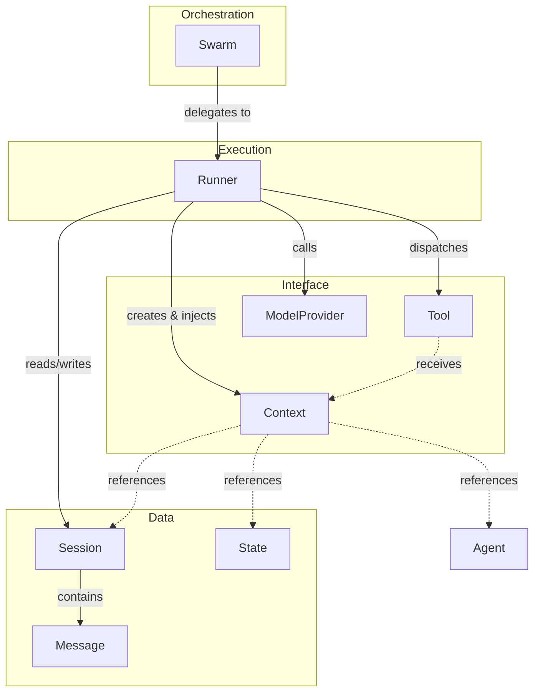
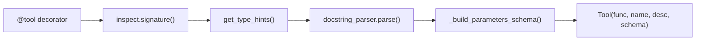
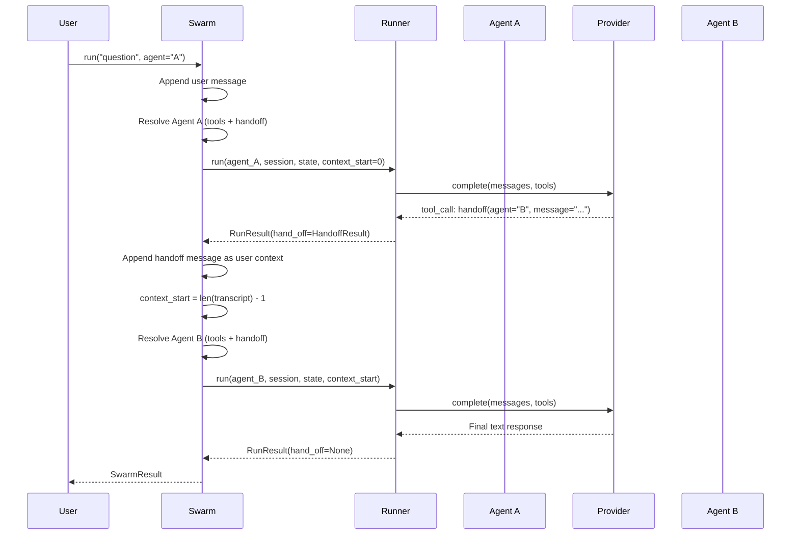
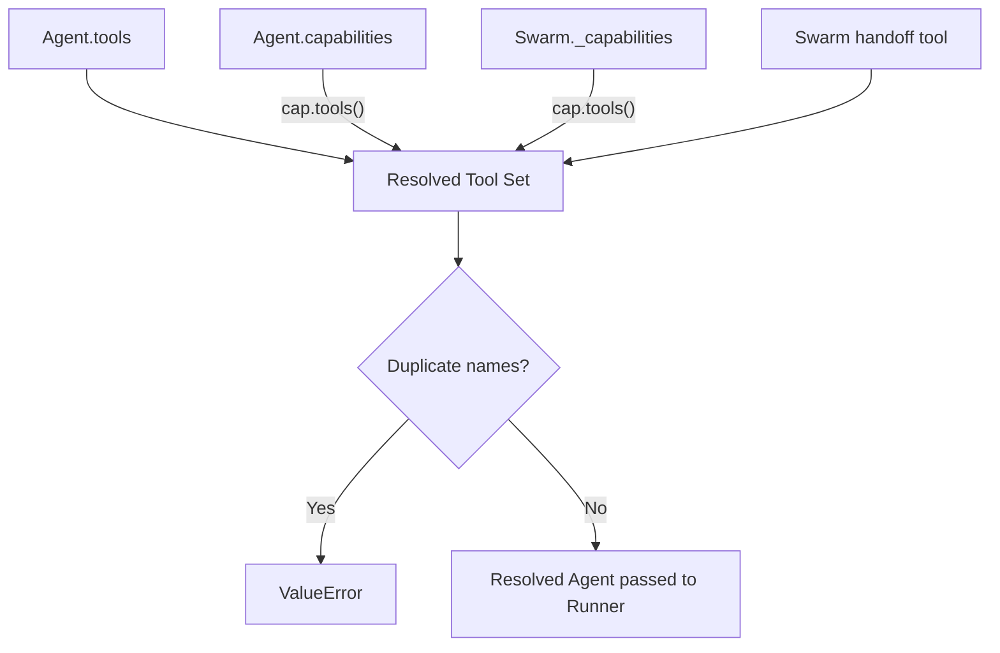
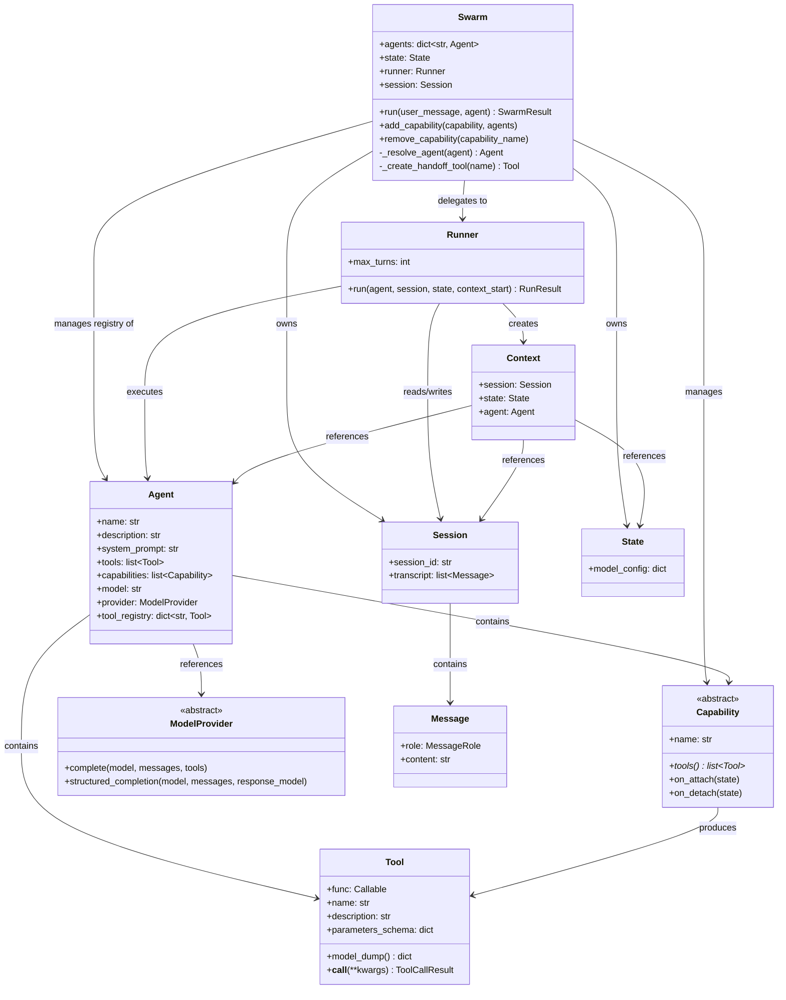
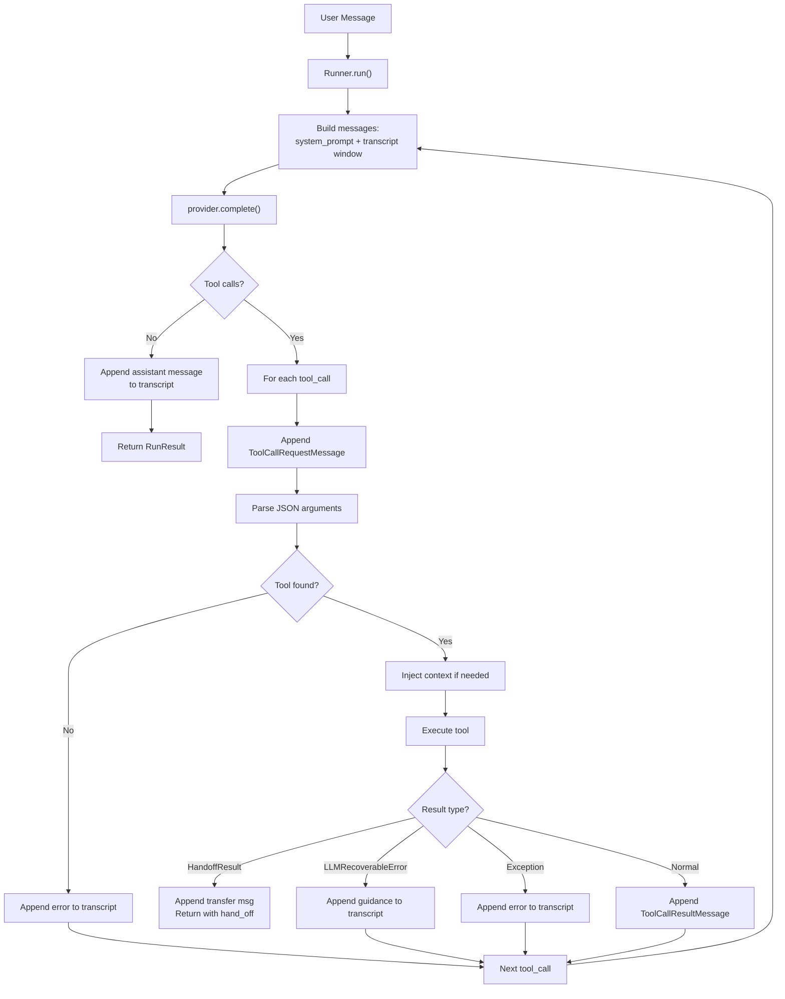

# lemurian

## Overview

Lemurian is a Python framework for building AI agents. It provides a
layered architecture for single-agent tool-calling loops and multi-agent
orchestration with dynamic handoffs. The framework is built on three
core principles:

1. **Declarative agents** — an Agent is a data object (Pydantic model)
   that bundles a system prompt, tools, model identifier, and provider.
   Agents never execute themselves.
2. **Single writer for conversation state** — the Runner is the only
   component that reads or writes the Session transcript. All other
   components receive state through explicit parameters.
3. **OpenAI-compatible wire format** — all message and tool schemas use
   the OpenAI chat completion format, allowing any provider that speaks
   this protocol to plug in.

---

## Architecture Layers

The framework is organized into four layers, each with a well-defined
responsibility boundary:

| Layer | Components | Responsibility |
|---|---|---|
| **Orchestration** | `Swarm` | Registers agents, creates handoff tool, manages handoff loop, tracks active agent |
| **Execution** | `Runner` | Builds messages for provider, injects system prompt, appends responses and tool results, detects handoffs |
| **Interface** | `Context`, `Tool`, `ModelProvider` | Tools use Context to access state/session/agent. Provider receives pre-built messages and schemas. |
| **Data** | `Session`, `State`, `Message` | Session holds the transcript (ground truth). State holds typed application data. |



---

## Core Abstractions

### Tool System

The `@tool` decorator converts a plain Python function into a `Tool`
object with an OpenAI-compatible JSON schema. Schema generation happens
at decoration time, not at runtime.

```python
class Tool(BaseModel):
    """A callable tool with an OpenAI-compatible function schema.

    Wraps a sync or async function. The JSON schema is generated from
    the function's type hints and docstring at decoration time via
    @tool. Parameters named 'context' are excluded from the schema
    and injected by the Runner at call time.

    Responsibilities:
    - Serialize to OpenAI function-tool format via model_dump()
    - Execute the wrapped function (sync or async) via __call__
    - Return ToolCallResult containing tool name and output
    """

    func: Callable = Field(exclude=True)
    name: str
    description: str
    parameters_schema: dict

    def model_dump(self, **kwargs) -> dict:
        ...

    async def __call__(self, **kwargs) -> ToolCallResult:
        ...
```

**Special result types:**

- `ToolCallResult` — wraps the tool's return value with the tool name.
- `HandoffResult` — signals to the Runner that the conversation should
  transfer to a different agent. Contains `target_agent` and `message`.
- `LLMRecoverableError` — exception carrying tool-authored guidance
  that the LLM can use to retry with correct arguments.

**Schema generation pipeline:**



Parameter descriptions are extracted from docstrings using
`docstring_parser` with auto-detection, supporting Google, NumPy,
Sphinx/reST, and Epydoc styles. The `context` parameter is silently
excluded from the generated schema.

### Agent

```python
class Agent(BaseModel):
    """Declarative agent definition — a data object, not an executor.

    Bundles everything the Runner needs to execute: system prompt,
    tools, model identifier, and provider. The tool_registry property
    merges tools from both the direct 'tools' list and any attached
    Capabilities.

    Agents are immutable declarations. The Runner receives an Agent
    and drives the loop; the Swarm may model_copy() an Agent to
    inject additional tools (e.g., the handoff tool).
    """

    name: str
    description: str = ""
    system_prompt: str
    tools: list[Tool] = Field(default_factory=list)
    capabilities: list[Capability] = Field(default_factory=list)
    model: str
    provider: ModelProvider

    @property
    def tool_registry(self) -> dict[str, Tool]:
        ...
```

### Runner

```python
class Runner:
    """The agent execution loop — the only component that mutates
    the Session transcript.

    On each turn:
    1. Build messages = [system_prompt] + transcript[context_start:]
    2. Call provider.complete() with messages and tool schemas
    3. If response has no tool calls, append assistant message and return
    4. For each tool call:
       a. Append ToolCallRequestMessage to transcript
       b. Look up tool in registry, parse JSON args
       c. Inject context if tool signature has 'context' param
       d. Execute tool, handle errors (LLMRecoverableError, generic)
       e. If result is HandoffResult, return with hand_off set
       f. Otherwise append ToolCallResultMessage to transcript
    5. Repeat until max_turns exceeded

    The context_start parameter enables fresh-context handoffs:
    the Swarm advances it so each agent sees only the handoff
    message onward, not the full prior conversation.
    """

    def __init__(self, max_turns: int = 50):
        ...

    async def run(
        self,
        agent: Agent,
        session: Session,
        state: State,
        context_start: int = 0,
    ) -> RunResult:
        ...
```

### Swarm

```python
class Swarm:
    """Multi-agent orchestrator with dynamic handoffs.

    Manages an agent registry and a single shared Session. On each
    run() call:
    1. Append the user message to the transcript
    2. Resolve the active agent's tools (own + capabilities + handoff)
    3. Run the Runner
    4. If a handoff occurs, advance context_start and switch agents
    5. Repeat until a final response or max_handoffs exceeded

    The Swarm is stateful across run() calls — the same Session
    and State persist, making it suitable for interactive loops.

    Capabilities can be added at swarm level (shared across agents)
    or at agent level (self-contained). The Swarm validates that
    no two tools share the same name before execution.
    """

    def __init__(
        self,
        agents: list[Agent],
        state: State | None = None,
        runner: Runner | None = None,
        max_handoffs: int = 10,
    ):
        ...

    async def run(
        self, user_message: str, agent: str | None = None
    ) -> SwarmResult:
        ...
```

**Handoff data flow:**



### Session, State, and Context

```python
class Session(BaseModel):
    """The conversation transcript — ground truth of the conversation.

    One Session is shared across all agents in a Swarm. Only the
    Runner appends to the transcript. The Swarm controls visibility
    via context_start windowing.
    """
    session_id: str
    transcript: list[Message] = []


class State(BaseModel):
    """Base class for typed application state.

    Subclass to add fields that persist across turns and handoffs.
    Mutated in-place by tools via context.state. The State is never
    serialized into the transcript — it exists as a side channel.
    """
    model_config = {"arbitrary_types_allowed": True}


@dataclass
class Context:
    """Runtime context injected into tools declaring a 'context' param.

    Created once per Runner.run() invocation. Provides tools with
    read/write access to the session, state, and current agent
    without those references appearing in the tool's JSON schema.
    """
    session: Session
    state: State
    agent: Agent
```

### Capability System

```python
class Capability(ABC):
    """A cohesive group of tools with shared state and lifecycle.

    Capabilities sit between individual tools and full agents.
    They group related tools, own internal state, and have lifecycle
    hooks that fire on attachment/detachment from a Swarm.

    Two attachment modes:
    - Agent-level: passed in Agent(capabilities=[...]). Tools are
      merged via agent.tool_registry. No lifecycle hooks called.
    - Swarm-level: added via swarm.add_capability(). Lifecycle hooks
      (on_attach, on_detach) are called with the shared State.

    The tools() method is called each time the Swarm resolves an
    agent's tool set, allowing capabilities to return tools that
    close over mutable internal state.
    """

    def __init__(self, name: str):
        ...

    @abstractmethod
    def tools(self) -> list[Tool]:
        ...

    def on_attach(self, state: State) -> None:
        ...

    def on_detach(self, state: State) -> None:
        ...
```

**Capability resolution flow:**



### Model Providers

```python
class ModelProvider:
    """Base class for LLM API providers.

    Providers receive pre-built message dicts and tool schema dicts
    from the Runner. They do not interact with lemurian types
    directly — the Runner handles all serialization.

    Two methods:
    - complete(): standard chat completion with optional tool calling
    - structured_completion(): parse response into a Pydantic model
    """

    async def complete(
        self,
        model: str,
        messages: list[dict],
        tools: list[dict] | None = None,
    ):
        ...

    async def structured_completion(
        self,
        model: str,
        messages: list[dict],
        response_model: BaseModel,
    ):
        ...
```

**Provider implementations:**

| Provider | Backend | Auth |
|---|---|---|
| `OpenAIProvider` | OpenAI | `OPENAI_API_KEY` |
| `OpenRouter` | OpenRouter | `OPENROUTER_API_KEY` |
| `VLLMProvider` | vLLM | `VLLM_API_KEY` |

All providers use the `openai` Python package internally via
`AsyncOpenAI`, taking advantage of the OpenAI-compatible API format
that vLLM and OpenRouter expose.

---

## Component Relationship Diagram



---

## Data Flow: Single Agent Run



---

## Glossary

| Term | Definition |
|---|---|
| **Agent** | Declarative configuration bundling prompt, tools, model, and provider |
| **Capability** | Reusable group of tools with lifecycle hooks |
| **Compaction** | Rewriting the transcript to reduce token count |
| **Context** | Runtime object injected into tools for state access |
| **Fresh-context handoff** | Technique where a new agent sees only the handoff message onward |
| **Handoff** | Transfer of conversation control from one agent to another |
| **MCP** | Model Context Protocol — standard for tool interoperability |
| **Provider** | Adapter for an LLM API (OpenAI, vLLM, etc.) |
| **Runner** | The agent execution loop; sole writer of the transcript |
| **Session** | Container for the conversation transcript |
| **State** | Typed application data persisting across turns and handoffs |
| **Swarm** | Multi-agent orchestrator managing handoffs and shared state |
| **Tool** | A decorated Python function exposed to an LLM with a JSON schema |
| **Transcript** | Ordered list of Messages forming the conversation history |
